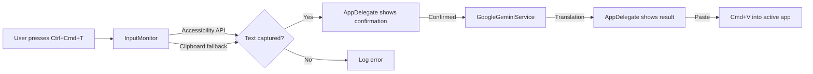

# 🌐 On-Fly Translator

A lightweight macOS **menu bar application** that translates text on-the-fly using the **Google Gemini API**. Press a global hotkey, confirm the captured text, and the translated result is pasted right back into your active application — no window switching required.

---

## ✨ Features

| Feature | Description |
|---|---|
| **Global Hotkey** | `Ctrl + Cmd + T` triggers translation from any application |
| **AI-Powered Translation** | Uses Google Gemini Flash for fast, accurate translations |
| **Smart Text Capture** | Attempts the Accessibility API first, falls back to clipboard-based Select All → Copy macro |
| **Confirmation Dialogs** | Shows captured text for review before translating, and the result before pasting |
| **Multi-Language Support** | English, Spanish, French, German, Chinese, Japanese, Russian + Auto-detect |
| **Menu Bar Integration** | Lives in the macOS menu bar — no Dock icon, no main window |
| **Persistent Preferences** | Remembers source/target language and enabled state across launches |
| **File Logging** | All operations logged to `~/translator.log` for debugging |

---

## 🏗️ Architecture

```
on-fly-translator/
├── Sources/
│   ├── main.swift                  # App entry point — creates NSApplication
│   ├── AppDelegate.swift           # Menu bar UI, language selection, permission prompts
│   ├── InputMonitor.swift          # Carbon hotkey registration, text capture macro
│   ├── GoogleGeminiService.swift   # Gemini REST API client
│   └── Logger.swift                # Singleton file logger
├── Tests/
│   ├── GoogleGeminiServiceTests.swift
│   ├── InputMonitorTests.swift
│   └── LoggerTests.swift
├── Info.plist                      # App bundle metadata (LSUIElement = true)
├── Package.swift                   # Swift Package Manager manifest
├── build.sh                        # Compiles and code-signs the .app bundle
├── test.sh                         # Compiles and runs unit tests
├── automated_setup.sh              # Guides permission setup via Terminal
└── .env.example                    # Template for API key environment variable
```

### Component Overview



| Component | Responsibility |
|---|---|
| **`AppDelegate`** | Menu bar setup, language settings UI, permission checks, translation dialog flow |
| **`InputMonitor`** | Registers `Ctrl+Cmd+T` via the Carbon `EventHotKey` API, captures text via the Accessibility API or clipboard macro, coordinates paste-back |
| **`GoogleGeminiService`** | Builds and sends requests to the Gemini `generateContent` endpoint, parses JSON responses |
| **`Logger`** | Thread-safe singleton that appends timestamped messages to `~/translator.log` |

---

## 📋 Requirements

- **macOS 13 (Ventura)** or later
- **Swift 5.9+** (ships with Xcode 15+)
- **Google Gemini API Key** — [get one here](https://aistudio.google.com/app/apikey)
- **Accessibility + Input Monitoring permissions** (the app prompts you on first launch)

---

## 🚀 Getting Started

### 1. Clone the Repository

```bash
git clone https://github.com/mavrovde/on-fly-translator.git
cd on-fly-translator
```

### 2. Set Up Your API Key

Choose **one** of the following methods:

#### Option A — Environment Variable (recommended for development)

```bash
cp .env.example .env
# Edit .env and replace YOUR_API_KEY_HERE with your actual key
export GEMINI_API_KEY=your_actual_key
```

#### Option B — Paste via the App Menu

After launching the app, copy your API key to the clipboard and click **"Paste API Key from Clipboard"** in the menu bar dropdown.

### 3. Build the Application

```bash
./build.sh
```

This will:
1. Compile all Swift source files with optimizations (`-O`)
2. Create the app bundle at `build/on-fly-translator.app`
3. Copy `Info.plist` into the bundle
4. Ad-hoc code-sign the bundle for stable identity

### 4. Grant Permissions

The app requires two macOS permissions:

| Permission | Why |
|---|---|
| **Input Monitoring** | To listen for the global `Ctrl+Cmd+T` hotkey |
| **Accessibility** | To read selected text and simulate `Cmd+C` / `Cmd+V` keystrokes |

**Automated setup** (guided Terminal wizard):

```bash
./automated_setup.sh
```

This script resets existing permissions, opens System Settings to the correct pane, reveals the app in Finder for drag-and-drop, and then launches the app once you confirm.

**Manual setup:**

1. Open **System Settings → Privacy & Security → Input Monitoring**
2. Add and enable `on-fly-translator.app`
3. Open **System Settings → Privacy & Security → Accessibility**
4. Add and enable `on-fly-translator.app`
5. Launch the app: `open build/on-fly-translator.app`

### 5. Launch

```bash
open build/on-fly-translator.app
```

Look for the 💬 speech bubble icon in your menu bar.

---

## 📖 Usage

### Translation Workflow

1. **Select text** in any application (or leave it — the macro will Select All)
2. Press **`Ctrl + Cmd + T`**
3. A dialog appears showing the captured text → click **"Translate"**
4. A second dialog shows the translation → click **"Paste"**
5. The translated text is pasted into the original application ✅

> [!TIP]
> A glass sound 🔔 plays on successful paste. An error sound plays if translation fails.

### Menu Bar Options

| Menu Item | Action |
|---|---|
| **Source: \<language\>** | Choose the input language (or Auto-detect) |
| **Target: \<language\>** | Choose the output language |
| **Enable Translation** | Toggle the hotkey on/off (`Ctrl+Cmd+T`) |
| **Paste API Key from Clipboard** | Save the Gemini API key from your clipboard |
| **Get API Key…** | Opens the Google AI Studio API key page |
| **Check Permissions** | Re-checks Accessibility permissions and starts the input monitor |
| **Quit** | Exits the application (`Cmd+Q`) |

---

## 🧪 Development

### Running Tests

```bash
./test.sh
```

The test script compiles `GoogleGeminiService.swift`, `Logger.swift`, and the test files into a standalone test binary, then executes it. Test coverage includes:

- **`GoogleGeminiServiceTests`** — request body construction, missing API key error  
- **`InputMonitorTests`** — initialization state, hotkey handling  
- **`LoggerTests`** — singleton identity, file write verification  

### Building with Swift Package Manager

While `build.sh` uses `swiftc` directly for simplicity, SPM is also configured:

```bash
swift build        # Debug build
swift build -c release   # Optimized release build
swift test         # Run tests via SPM
```

> [!NOTE]
> SPM builds output to `.build/` while the `build.sh` script outputs to `build/on-fly-translator.app`.

### Project Configuration

| File | Purpose |
|---|---|
| `Package.swift` | SPM manifest — targets macOS 13+, defines executable and test targets |
| `Info.plist` | Bundle ID: `com.user.on-fly-translator`, `LSUIElement: true` (no Dock icon) |
| `.gitignore` | Ignores `build/`, `.build/`, Xcode artifacts, logs, and `.env` |

### API Key Priority

The `GoogleGeminiService` resolves the API key in this order:

1. **Environment variable** `GEMINI_API_KEY`
2. **UserDefaults** key `GeminiAPIKey` (set via the menu bar "Paste API Key" option)

### Logging

All events are logged to **`~/translator.log`** with ISO 8601 timestamps:

```
[2026-02-17T00:00:00Z] Carbon Hotkey Registered Successfully.
[2026-02-17T00:00:05Z] Carbon Hotkey Detected! Triggering macro...
[2026-02-17T00:00:05Z] Captured Text via AX: Hello world...
[2026-02-17T00:00:06Z] Translation success: Hallo Welt
[2026-02-17T00:00:07Z] Pasted translation.
```

---

## 🔧 Troubleshooting

| Problem | Solution |
|---|---|
| **Hotkey not responding** | Check that Input Monitoring is enabled in System Settings. Try "Check Permissions" from the menu. |
| **"Clipboard empty" in logs** | Grant Accessibility permission — the app needs it to simulate `Cmd+C`. |
| **"API Error" or "No API Key"** | Verify your Gemini API key is set (env var or menu). Check network connectivity. |
| **App not visible** | Look for the speech bubble icon in the menu bar. The app has no Dock icon by design (`LSUIElement: true`). |
| **Translation pastes into wrong app** | Ensure you don't click other windows between confirming and pasting. The app hides itself to restore focus. |
| **Permission prompt not appearing** | Run `./automated_setup.sh` to reset and re-configure permissions. |

### Viewing Logs

```bash
tail -f ~/translator.log
```

---

## 🛡️ Privacy & Security

- **No data collection** — text is sent directly to the Google Gemini API and not stored anywhere except the local log file.
- **API key stored locally** — saved in macOS `UserDefaults` (per-user, not shared).
- **Ad-hoc code signing** — the build script signs the bundle with an ad-hoc identity for stable permission grants across rebuilds.
- **No network calls** unless a translation is explicitly triggered by the user.

---

## 📄 License

This project is provided as-is for personal use.

---

## 🤝 Contributing

1. Fork the repository
2. Create a feature branch (`git checkout -b feature/my-improvement`)
3. Make your changes and add tests
4. Run `./test.sh` to verify
5. Commit and push
6. Open a Pull Request
